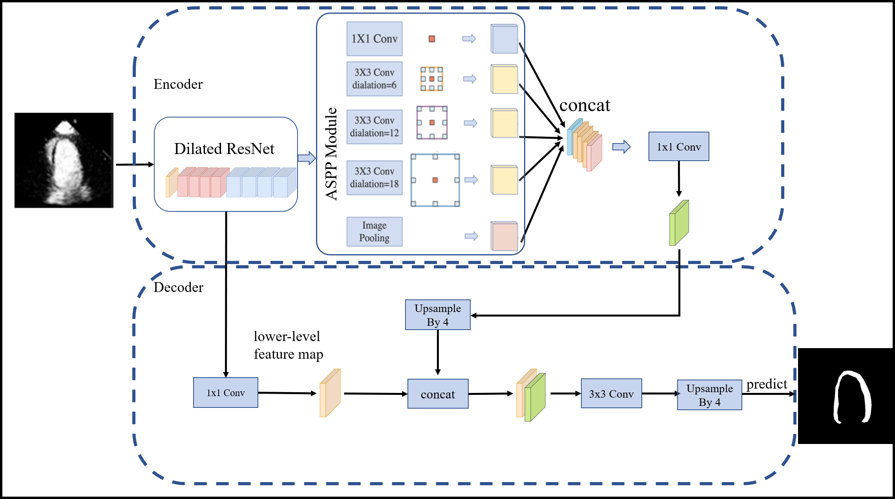
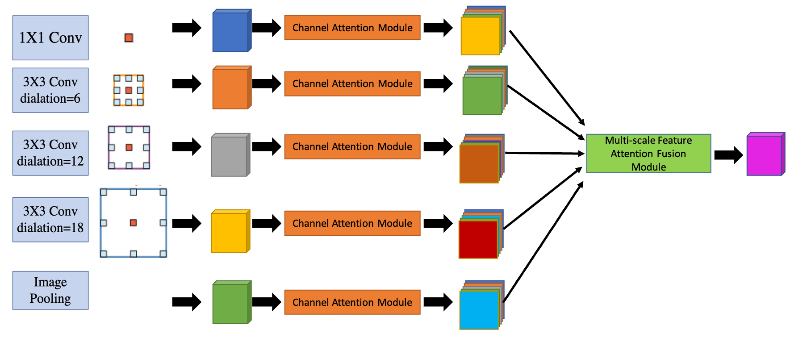
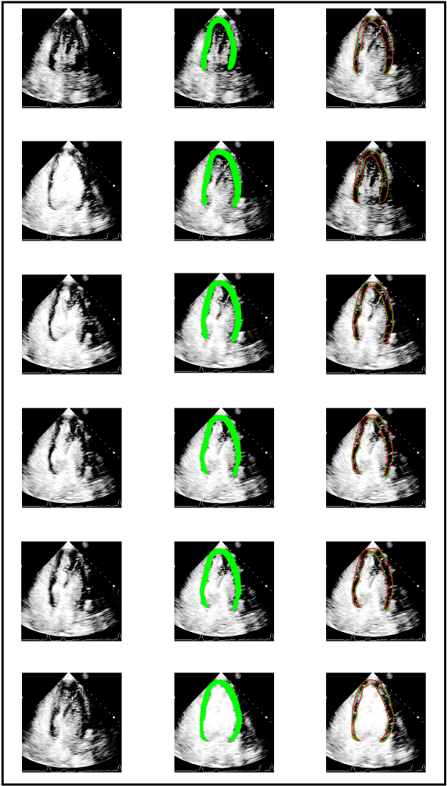

# myocardial contrast echocardiography myocardium segmentation  

The MCE-Net (Myocardial Contrast Echocardiography Network) Segmentation Algorithm employs an advanced methodology based on the DeeplabV3+ architecture, integrating attention mechanisms such as the Channel Attention Module and Multi-scale Feature Attention Fusion Module.
# network architecture
## original deeplabv3+

[DeepLabv3+](https://arxiv.org/abs/1802.02611) is an advanced image segmentation model designed for accurately labeling pixels in input images. Using techniques like dilated convolutions, spatial pyramid pooling, and a decoder module, it excels in capturing details and context. This model is particularly effective in tasks requiring precise semantic segmentation in computer vision applications.

## improved ASPP
The ASPP (Atrous Spatial Pyramid Pooling) module is a crucial component in DeepLabV3+, capturing multi-scale semantic information by employing different dilation rates. However, despite its excellent performance in capturing multi-scale features, the module uses a simple concatenation operation when fusing these features. This approach may not fully exploit and leverage the correlations between features at different scales. Therefore, we introduce a channel attention module and a multi-scale feature attention aggregation module .

### Channel Attention Module
Introducing a channel attention module significantly enhances feature representation by dynamically adjusting the importance of different channels within the maps. This adaptive mechanism allows the network to selectively emphasize informative channels, contributing to a more effective and discriminative representation of features.

The Channel Attention Module is a structural component that aims to improve feature representation in neural networks. It operates through a two-step process: firstly, a global pooling operation is applied across feature map channels to extract comprehensive information. Subsequently, adaptive channel-wise weights are computed based on the pooled information in order to influence the original feature map. This process enables the network to selectively enhance or diminish specific channels, thereby enhancing the model's capacity to capture and utilize informative features effectively.
$$y_i=\frac1{H\times W}\sum_{j=1}^H\sum_{k=1}^Wx_{ijk}$$

Where $y_i$ is the output value for the $i$ th channel, $H$ and $W$ are the height and width of the feature map, and $x_{ijk}$ is the input value at position $(i, j)$ for the $k$ th channel.
### Multi-Scale Feature Attention Aggregation Module 
In DeepLabV3+, the ASPP module captures multi-scale semantic information by employing convolutional kernels with different dilation rates. However, the conventional approach after the ASPP output layer involves a simple concatenation operation to fuse these multi-scale features, which may fall short in capturing the correlations between different feature maps.

To address this limitation, this paper introduces a Multi-Scale Feature Attention Aggregation Module based on an attention mechanism. This module facilitates a more effective fusion of contextual information from different network layers, enabling the model to flexibly capture correlations across various scales and semantic hierarchies. Leveraging the attention mechanism, the model selectively emphasizes or suppresses information from different feature maps, thereby enhancing adaptability to objects of different sizes and diverse semantic scenes.
$$Z_k=\sigma\left(\sum_{i=1}^Nw_i\cdot X_i^k\right)$$
$Z_k$ represents the result  feature map, $X_i^k$ denotes the feature in the $i$-th feature map, $w_i$ is the weight calculated through the attention mechanism, measuring each feature map's contribution to the final fusion result, and $σ$ is the sigmoid activation function.
# result 
## dice and IoU comparision
|      |     | improved DeeplabV3+ | original DeeplabV3+ | [Li](https://link.springer.com/article/10.1007/s10554-021-02181-8) | PSPnet | U-net |
|------|-----|---------------------|---------------------|-------|--------|-------|
| dice |     |                     |                     |       |        |       |
|      | A2C |**0.86**                | 0.84                | 0.81  | 0.83   | 0.82  |
|      | A3C |**0.86**                | 0.83                | 0.81  | 0.84   | 0.82  |
|      | A4C |**0.88**                | 0.84                | 0.82  | 0.83   | 0.80  |
| IoU  |     |                     |                     |       |        |       |
|      | A2C |**0.74**                | 0.72                | 0.69  | 0.73   | 0.69  |
|      | A3C |**0.74**               | 0.71                | 0.65  | 0.72   | 0.70  |
|      | A4C |**0.78**                | 0.75                | 0.71  | 0.72   | 0.72  |
## segmentation result

